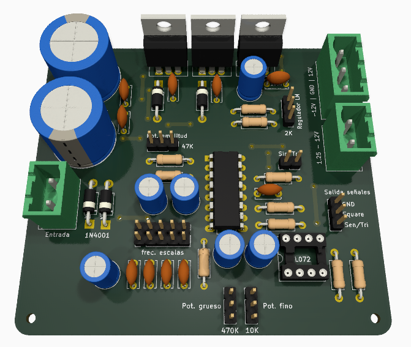
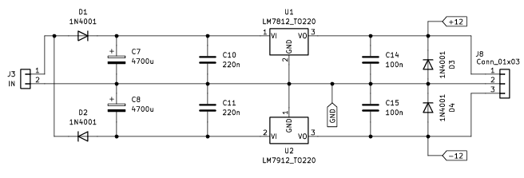
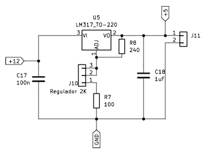
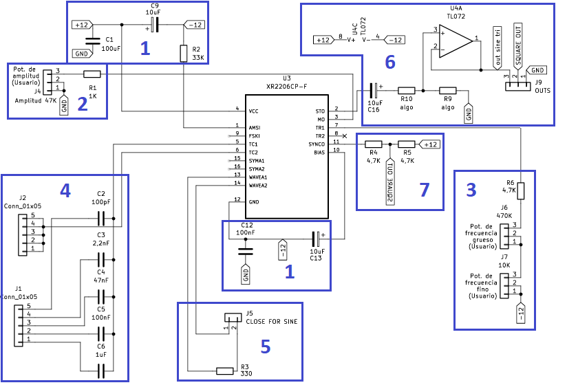
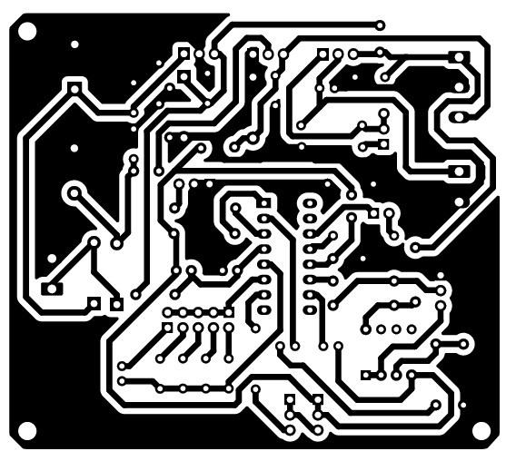
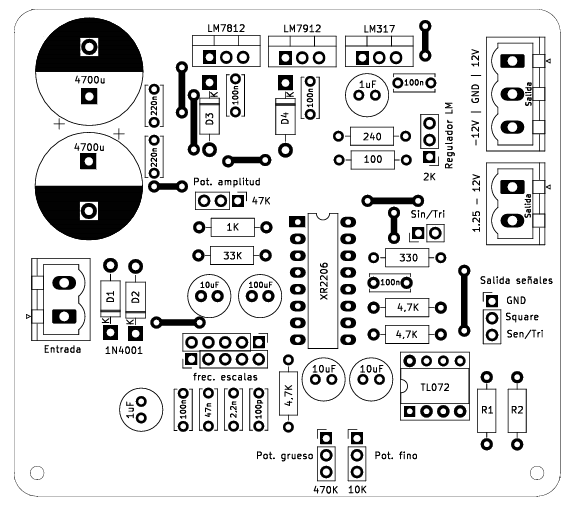

# Fuente Regulada - Generador de señales

## Descripción
Este proyecto consiste en el diseño y desarrollo de una fuente de tensión regulable que incorpora un generador de señales, pensado como una herramienta útil en laboratorios para proyectos de experimentación o entornos educativos. La fuente de alimentación está diseñada para ofrecer salidas de voltaje positivo y negativo, junto con una salida de tensión regulable según las necesidades que se requiera en una aplicación especifica. Además de su aplicación como fuente, el sistema incluye un generador de señales basado en el integrado XR2206CP, circuito integrado utilizado para la generación de distintos tipos de señales, el cual permite generar señales senoidales, triangulares y cuadradas. Su frecuencia de operación es configurable en un rango amplio que va desde 2 Hz hasta 1.3 MHz, lo que lo hace adecuado para una gran variedad de pruebas.
El generador de señales incorpora un mecanismo de ajuste tanto fino como grueso. Además, cuenta con un control de amplitud que permite al usuario variar la amplitud de las señales generadas según se quiera, la placa se presenta a continuación. 

  
   
  <em>Fig 1: Renderizado de la fuente regulada y generador de señales</em>

El artículo tiene como objetivo ofrecer una visión general de los componentes que componen el funcionamiento de la placa, abarcando sus principales características y especificaciones del sistema. Además, incluirá los archivos de software requeridos para su fabricacion, tales como los esquemas electrónicos, esquema de impresión de PCB, etc.

## Caracteristicas

A continuacion se nombran las caracteristicas de la placa 

| **Etapa**                     | **Descripción**                                           |
|------------------------------------|-----------------------------------------------------------|
| **Entrada de alimentación**        | Transformador de 20V eficaces                              |
| **Salidas de voltaje fijo**        | +12V y -12V                                               |
| **Salidas de voltaje regulable**   | 1.25V hasta 10V                                           |
| **Salidas de señales**             | Senoidal, cuadrada y triangular                           |
| **Variación de amplitud**          | Ajuste de amplitud de señales generadas (senoidales y triangulares) |
| **Variación de frecuencia**        | Ajuste fino y grueso de frecuencia con sus respectivas escalas |
| **Selector de señales**            | Switch para cambiar entre señal senoidal a triangular     |

- Escalas de frecuencia

Cada escala corresponde a las posiciones del selector de izquierda a derecha como se muestra a continuación
| **Escala** | **Rango**          |
|------------|--------------------|
| 1          | 2Hz – 220Hz        |
| 2          | 20Hz – 2.2KHz      |
| 3          | 450Hz – 50KHz      |
| 4          | 2KHz – 200KHz      |
| 5          | 25KHz – 1.3MHz     |

## Descripción general del hardware

Se detallan los componentes utilizados en el diseño, y se explica su funcionalidad dividida en módulos para facilitar la comprensión de cada parte del sistema.

- ### Fuente regulable +-12V

La implementación de la fuente consiste en un transformador reductor a 20 Volts eficaces. Mientras mayor sea la tensión eficaz de entrada peor es el rendimiento de la fuente, ya que esa tensión cae en los reguladores LM7812 y LM7912 aumentando la disipación de potencia teniendo la misma corriente de salida.

  
   
  <em>Fig. 2: Esquemático de fuente regulada +-12V.</em>

- ### Fuente regulable 2V – 10V

El circuito de la fuente regulable mostrado a continuación utiliza directamente la salida de 12V generada por el circuito anterior (Fig. 2). Este diseño incluye un potenciómetro de 2 kΩ para permitir la variación de tensión, complementado con capacitores de filtro.

  
   
  <em>Fig.3: Esquemático de fuente regulable 2V – 10V.</em>

- ### Generador de señales

Debajo de la imagen se describe el funcionamiento de cada uno de los bloques para un mejor entendimiento.

  
   
  <em>Fig.4: Esquemático del circuito generador de señales.</em>

| **Bloque** | **Descripción**                                                                                                                                   |
|------------|---------------------------------------------------------------------------------------------------------------------------------------------------|
| 1          | Alimentación: Toma los ±12V de la fuente regulable y cuenta con los filtros correspondientes para la reducción de ruido.                          |
| 2          | Control de amplitud: Afecta solamente la salida senoidal y triangular, permitiendo ajustar la amplitud de estas señales.                         |
| 3          | Control de frecuencia (parte resistiva): Modifica la resistencia del oscilador RC para variar la frecuencia de la señal de salida.                |
| 4          | Control de frecuencia (parte capacitiva): Modifica la capacidad del oscilador RC para variar la frecuencia de la señal de salida.                 |
| 5          | Selector de señales seno y triangular: Un switch que permite intercambiar entre señal senoidal y triangular en el pin de salida. Si el switch permanece cerrado se obtiene una señal senoidal, de otro modo, se tendrá una señal tipo triangular. |
| 6          | Salida de señales senoidal y triangular: Etapa de eliminación de continua, utilizando un operacional TL072 para aislar las señales y evitar la carga de la salida del XR2206. |
| 7          | Salida de señal cuadrada: Se toma desde un divisor resistivo y no tiene control de amplitud.                                                     |

## Fabricación del circuito

Se proporcionan los archivos necesarios para la fabricación de la placa, ya sea de manera casera, mediante el uso de una CNC, o para su envío a empresas de producción de circuitos profesionales. También se tendrá una tabla de los componentes necesarios.

Para descargar la carpeta con los archivos de KiCad visitar el siguiente link: [Carpeta de arcivos de KiCad](Archivos/Fuente)

A continuación, se muestran ambas caras de la placa.

  
   
  <em>Fig.5: Pistas para fabricación del PCB.</em>

  
   
  <em>Fig.6: Disposición de los componentes del sistema.</em>

Si se desea descargar los esquematicos mostrados, se encuentran a continuacion:

- [Pistas (Capa inferior)](Archivos/Fuente%20Generadora%201.0%20Cobre.pdf)
- [Componentes (capa superior)](Archivos/Fuente%20Generadora%201.0%20Frente.pdf)

Los componentes necesarios para la fabricacion son se ven en la siguiente tabla.

### Componentes

| Componente               | Nota                          | Valor         |
|--------------------------|-------------------------------|---------------|
| **J3**                    | Conector Phoenix 2 Pines      | -             |
| **J11**                   | Conector Phoenix 2 Pines      | -             |
| **J8**                    | Conector Phoenix 3 Pines      | -             |
| **J9**                    | Conector 3 Pines              | -             |
| **J1**                    | Conector 5 Pines              | -             |
| **J2**                    | Conector (1 pin o 5 pines)    | -             |
| **J5**                    | Conector 2 Pines              | -             |
| **J4, J6**                | Conector 3 Pines p/potenciómetro | 500kΩ       |
| **J7**                    | Conector 3 Pines p/potenciómetro | 10kΩ        |
| **J10**                   | Conector 3 Pines p/potenciómetro | 2kΩ         |
| **C2**                    | Capacitor cerámico            | 100pF         |
| **C3**                    | Capacitor cerámico            | 2,2nF         |
| **C4**                    | Capacitor cerámico            | 47nF          |
| **C5, C12, C14, C15, C17** | Capacitor cerámico            | 100nF         |
| **C10, C11**              | Capacitor cerámico            | 220nF         |
| **C1**                    | Capacitor electrolítico       | 100uF         |
| **C6, C18**               | Capacitor electrolítico       | 1uF           |
| **C7, C8**                | Capacitor electrolítico       | 4700uF        |
| **C9, C13, C16**          | Capacitor electrolítico       | 10uF          |
| **D1, D2, D3, D4**        | Diodo                         | 1N4001        |
| **U1**                    | Regulador lineal 12V          | LM7812        |
| **U2**                    | Regulador lineal -12V         | LM7912        |
| **U5**                    | Regulador lineal              | LM317         |
| **U4A**                   | Amplificador Operacional      | TL072         |
| **R1**                    | Resistencia                   | 1kΩ           |
| **R2**                    | Resistencia                   | 33kΩ          |
| **R3**                    | Resistencia                   | 330Ω          |
| **R4, R5, R6**            | Resistencia                   | 4,7kΩ         |
| **R7**                    | Resistencia                   | 100Ω          |
| **R8**                    | Resistencia                   | 240Ω          |
| **R9**                    | Resistencia                   | 680Ω          |
| **R10**                   | Resistencia                   | 10kΩ          |

Si se busca tener un entendimiento mas profundo de sistema, tales como las curvas de regulacion, respuesta en frecuencia y otros tipos de comportamientos, se recomienda leer la hoja de datos que se presenta a continuacion: [Hoja de datos](Archivos/Hoja_de_datos_Fuente_Regulable_y_generador.pdf)
